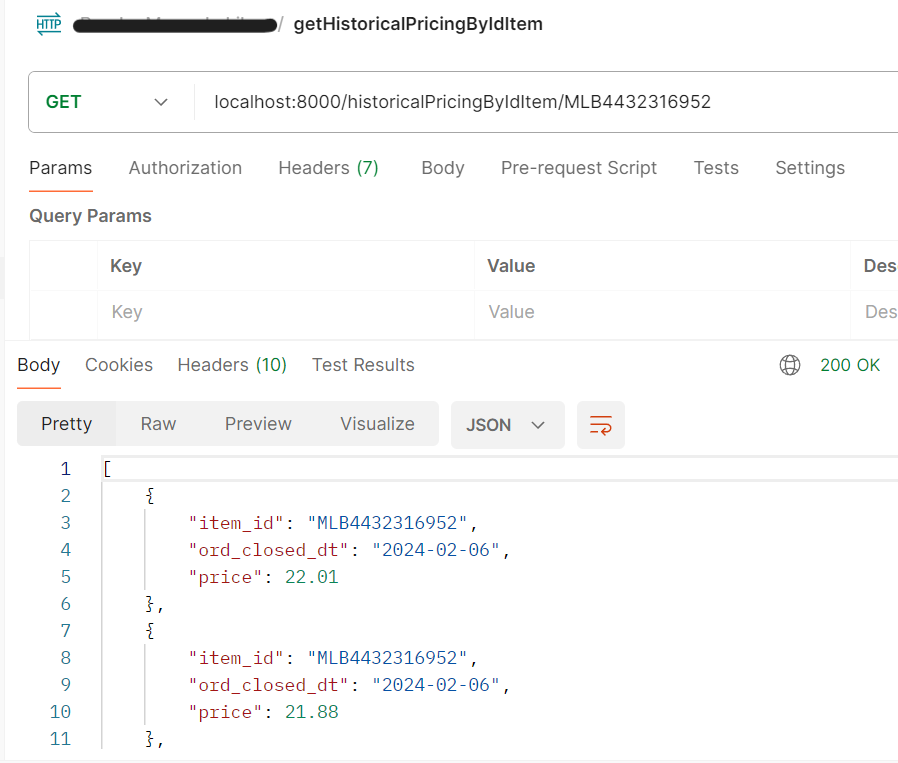
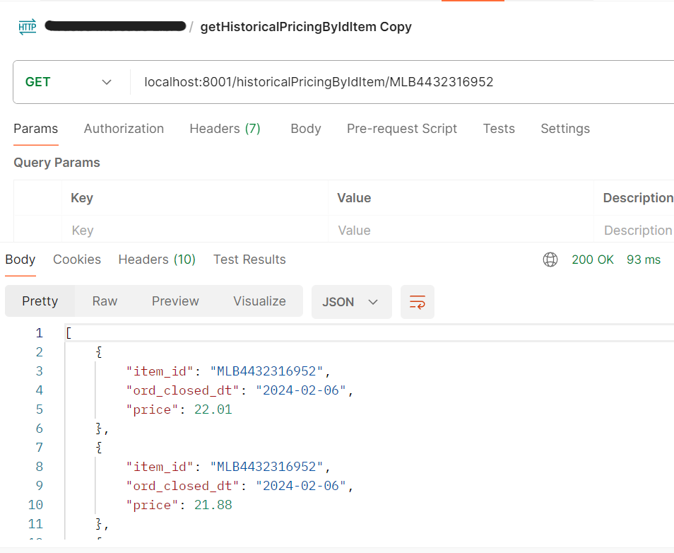
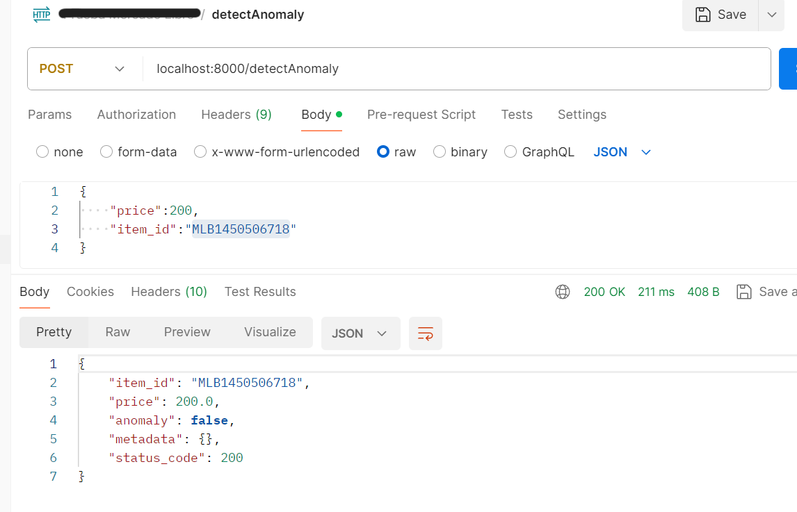

# anomaly_detection microservice
Arquitectura para un microservicio de deteccion de anomalias utilizando como framwork web django-rest-framework y la libreria scikitlearn y su funcionalidad de IsolationForest para realizar la deteccion de anomalias. Incluye un contenedor que corre un servicio de base de datos con el historico de precios y dos microservicio (con la misma funcionalidad pero diferente arquitectura de softeare) desarrollados con django y django-rest-framework. La deteccion de anomalias se hace con la ayuda de un historico de precios por item que puede ser cargado de forma automatica en la base de datos al levantar los contenedores o cargarlo por medio de un enpoint que exponen los microservicios.

El uso del IsolationForest se escogio por que es un modelo no supervisado, ideal para la data povista en el csv, el cual es liviano y rapido para su entrenamiento y tiene un buen margen de error y precisión. Un ejemplo lo podemos ver en la siguiente imagen que se extrajo para un item_id especifico del archivo precios_historicos.csv

## Estructura del repositorio
El repositorio cuenta con varias carpetas y subcarpetas.
- bdserver: tiene toda la configuracion de la base de datos. Aqui se puede encontrar el archivo csv con el historico de precios, un init.sql que se encarga de configurar la base de datos del microservicio y poblarla con el archivo precios_historicos.csv y el Dockerfile que se encarga de generar la imagen dockerizada para la base de datos

- csv generator: como uno de los requerimientos es tener un enpoint para cargar un archivo csv con el historico de precios pero, a gusto del desarrollador, se prefirio cargar el archivo csv original al momento de crear la base de datos, entonces se crea esta funcinalidad para generar un archvio con la misma estructura y caracteristicas del csv original pero mas corto, con el fin de probar la funcionalidad de carga de archivo plano del microservicio. Puede encontrar aca el archvio datagenerator.py que genera el archivo plano y data.csv que es un ejemplo del archivo generado

- ms_anom_detec_pric: es la carpeta con todos los scripts que conforma la aplicacion python-django-rest con su estrcutura clasica model/serializador/vista (MVC). Dentro tambien puede encontrar el Dockerfile que genera la imagen contenedora del microservicio y el archivo requirements.txt con las dependencias necesarias para correr la aplicacion

- ms_anom_detec_pric_CA: es la carpeta con todos los scripts que conforma la aplicacion python-django-rest con su estrcutura de Clean Architectura que permite una mayor flexibilidad y desacople de los componentes. Esto se hizo para tener adaptadores (uno para la base de datos y otro para el modelo de deteccion de anomalias), puntos de entrada (como son las vistas) y aislar el dominio (modelos y casos de uso) facilitando el plug and play de los diferentes componentes.
docker-compose: tiene la receta en formato yml para desplegar los contenedores con la base de datos, los microservicios y conectarlos por medio de una red virtual de docker.

## Como poner a funcionar la arquitectura
Arquitectura en local

Como se ha mencionado, la aplicacion fue desarrollada para correr sobre la plataforma Docker por medio del despliegue del docker-compose el cual generara las imagenes de docker que vemos en el diagrama. A la base de datos podemos acceder directamente con algun DBMS como pgadmin o dbbeaber y los microservicios pueden ser invocados sus enpoints por medio de aplicaciones como postman o insomnia.

Cabe resaltar que hay un mapeo de puerto, por ejemplo, la base de datos esta expuesta hacia el exterior de docker por el puerto 5050 pero al interor de la red de docker esta en el 5432. Lo mismo pasa con los microservicios que se exponen por cad auno de sus contenedores por el puerto 8000 pero para el exterior de docker son el 8000 y el 80001

Para poner a correr la arquitectura en local solo basta con:
1. Clonar el repositorio
2. Tener instalado Docker y docker compose
3. parados en la raiz del repositorio, poner a correr una consola de comandos cmd y correr el comando `docker-compose up`. Esto comenzara con la compilacion de las imagenes segun la declaracion de cada Dockerfile y finalmente desplegara en contenedores

cabe aclarar que este proceso puede tardar hasta mas de 20 minutos (dependiendo de la velocidad del host) por las librerias usadas (scikitlearn en especifico es muy pesada)

Si desea correr alguno de los microservicios fuera de docker lo puede hacer realizando las siguientes acciones parados en la raiz pero del microservicio (es decir, dentro de la carpeta del ms a correr):
1. generar el entorno virtual con el comando `python -m venv pricing_env`
2. instalar las dependencias con el comando `pip install -r requirements.txt`
3. ir al archivo setting.py y cambiar la configuracion de la base de datos para que apunte a una instancia desplegada local (localhost)

## pruebas de la ejecucion
Acontinuacion se muestran algunos pantallazos de prueba de las funcionalidades de los microservicios:
### Enpoint historicalPricingByIdItem/{item_id}
Este enpoint devuelve una lista con el historico de precios para un item_id especifico en orden ascendente. Esta funcionalidad apoya el enpoint de deteccion de anomalias ya que se utiliza para traer el historico filtrado por un item id y asi poder detectar si el nuevo precio para el item_id es o no una anomalia
- Prueba en el servicio django MVC (puerto 8000)

- prueba en el servicio django Clean Architecture (CA)(puerto 8001)

### Endpoint  detectAnomaly
Este enpoint devuelve en su respuesta una bandera indicando si el precio es o no una anomalia, ademas entrega el precio y su item_id. De no enocntrar el item_id en el historico el endpoint devuelve un error
- Prueba en el servicio django MVC 

- Prueba en el servicio django CA

-prueba error item_id no encontrado:

### Endpoint cargarCsvHistorico
Este endpoint permite subir un archivo csv con el formato de hsitorico de precios (ITEM_ID,ORD_CLOSED_DT,PRICE) para ser guardado en la base de datos y asi poder utilizar nueva informacion en los demas endpoints.
PAra esta prueba se procedera a truncar la base de datos (no hya lio, pues para restaurarla de nuevo con toda la data inicial solo basta con recrear la imagend e doker y desplegar de nuevo el contenedor y el docker compose nos facilita mucho recrear todo el ambiente cuando querramos)
- BD antes de truncar la tabla de historico 

- BD despues de truncar la tabla

- Prueba en el servicio django MVC 

- Prueba en el servicio django CA

OJO hay 400 registros por que son 200 de la prueba de MVC y 200 de la prueba de CA

## Arquitectura propuesta nube
Como se mostro, esta implementacion aun esta en un ambiente local. Aqui se presenta un draft de la propuesta de la arquitectura desplegada en AWS
 (1).jpg>)

En esta arquitectura se propone:
- Tener una herramienta para la gestion del ciclo de vida del software (Devops) (Azure, devops, Github pipelines, Jenkins etc) que entregue al ECR (Elastic Container Register) de AWS las imagenes de lo contenedores y las despliegue en pods del EKS con una estrategia de replicación y pruebas continuas liveness, readiness y startup a los diferentes microservicios y sus replicas.
- Tener 2 microservicios, uno encargado de la gestion del precio (recibir las peticiones con los nuevos precios, consumir el servicio expuesto por el segundo microservicio con el modelo para saber si un precio es anomalo o no), en caso de ser un precio anomalo generar una alerta o devolver una respuesta negativa y en caso de no ser anomalo el precio proceder a guardarlo en la base de datos (nodo master) como un nuevo precio del item. El segundo microservicio contendra el modelo de analisis de precios y se conectara a la replica de solo lectura de la base de datos
- Tener un cluster de RDS con un nodo master donde hacer operaciones que alteren el estado de la bd (a la cual se conectara el micro de gestion de precios) y un nodo de read replica para consultas masivas (al cual se conectara el micro del modelo de deteccion de anomalias)
-  Tener dentro del EKS un gateway de istio que gestione la seguridad de las peticiones que entran a los microservicios y el enrutamiento dentro del mismo EKS
- Tener las credenciales de acceso a las bases de datos en secretos del secret manager encriptados con KMS a los cuales pueda acceder los pods del EKS por medio de politicas y roles instaurados en el IAM
- Tener un balanceador de cargas de frente al EKS para que gestione las peticiones y como enrutarlas a las diferentes EC2 que soportan la infrastructura del Elastic Kubernetes Service
- Que las peticiones que van hacia los microservicios pasen por un servicio de WAF antes de llegar al balanceador de cargas para impedir ataques como inyeccion de codigo, DoDs, XSS entre otros
- Uso de herramientas como Grafana o Cloudwatch para realizar el monitoreo y observabilidad de los servicios